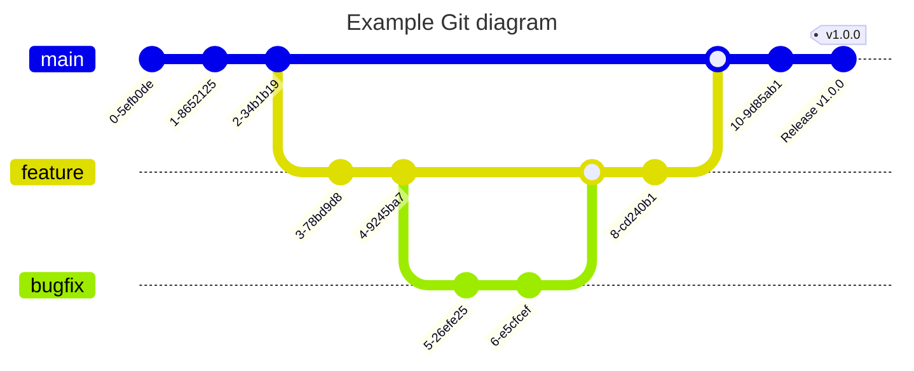

---
# You can also start simply with 'default'
theme: seriph
# random image from a curated Unsplash collection by Anthony
# like them? see https://unsplash.com/collections/94734566/slidev
background: https://cover.sli.dev
# some information about your slides (markdown enabled)
title: Clean Code for Beginners
info: |
  ## Clean Code for Beginners
  Clean Code and Code Quality Rules for Beginners
# apply unocss classes to the current slide
class: text-center
# https://sli.dev/features/drawing
drawings:
  persist: false
# slide transition: https://sli.dev/guide/animations.html#slide-transitions
transition: slide-left
# enable MDC Syntax: https://sli.dev/features/mdc
mdc: true
# take snapshot for each slide in the overview
# overviewSnapshots: true
---

# Clean Code for Beginners

lean Code and Code Quality Rules for Beginners

<div class="pt-12">
  <span @click="$slidev.nav.next" class="px-2 py-1 rounded cursor-pointer" hover="bg-white bg-opacity-10">
    Press Space for next page <carbon:arrow-right class="inline"/>
  </span>
</div>

<div class="abs-br m-6 flex gap-2">
  <button @click="$slidev.nav.openInEditor()" title="Open in Editor" class="text-xl slidev-icon-btn opacity-50 !border-none !hover:text-white">
    <carbon:edit />
  </button>
  <a href="https://github.com/forbai/clean-code-for-beginners" target="_blank" alt="GitHub" title="Open in GitHub"
    class="text-xl slidev-icon-btn opacity-50 !border-none !hover:text-white">
    <carbon-logo-github />
  </a>
</div>

---
transition: fade-out
---

# Why is Clean Code Important?

- **Readability**: Code is read more often than it is written
- **Maintainability**: Easier to maintain and extend
- **Debugging**: Easier to debug
- **Collaboration**: Easier to collaborate with others
- **Performance**: Cleaner code often performs better
- **Quality**: Higher quality code
- **Learning**: Learn from good code


<style>
h1 {
  background-color: #2B90B6;
  background-image: linear-gradient(45deg, #4EC5D4 10%, #146b8c 20%);
  background-size: 100%;
  -webkit-background-clip: text;
  -moz-background-clip: text;
  -webkit-text-fill-color: transparent;
  -moz-text-fill-color: transparent;
}
</style>

<!-- 
Clean Code is important because it makes the code more readable, maintainable, and easier to debug. It also makes it easier to collaborate with others and improve performance. Clean code is also higher quality and easier to learn from.
-->

---
layout: two-cols
layoutClass: gap-16
---

# Table of contents

<Toc v-click minDepth="1" maxDepth="2"></Toc>


---
transition: slide-up
title: Naming
---

# Why is Naming Important?

Naming is one of the most important aspects of writing clean code. It is the first thing that you see when you look at a piece of code.

## Code Example
````md magic-move
```javascript {2-6|8}
// Example 1: Poor Naming
function ab(a, b) {
  let x = 10;
  let y = a + b + x;
  console.log(y);
}

ab(5, 3);
```

```javascript {2-6|8|all}
// Example 1: Good Naming
function calculateTotalWithTax(basePrice, taxRate) {
  const BASE_TAX = 10;
  const totalWithTax = basePrice + (basePrice * (taxRate / 100)) + BASE_TAX;
  console.log(totalWithTax);
}

calculateTotalWithTax(50, 20);
```
````

<!--
Naming is important because it makes the code more readable and easier to understand. It is the first thing that you see when you look at a piece of code. Good naming makes the code easier to read and maintain.

In the example above, the function `calculateTotalWithTax` is a good name because it clearly describes what the function does. The variables `basePrice`, `taxRate`, `BASE_TAX`, and `totalWithTax` are also good names because they are descriptive and easy to understand.

In contrast, the function `ab` is a poor name because it does not describe what the function does. The variables `a`, `b`, `x`, and `y` are also poor names because they are not descriptive and do not provide any information about what they represent.
-->

---
title: Documentation
---

# Why are Comments and Documentation Important?
It is important to write comments and documentation to explain the code to others and to your future self.

## Code Example
````md magic-move
```javascript {all}
// Example 2: Poor Documentation
function calculateTotalWithTax(basePrice, taxRate) {
  const BASE_TAX = 10;
  const totalWithTax = basePrice + (basePrice * (taxRate / 100)) + BASE_TAX;
  console.log(totalWithTax);
}

calculateTotalWithTax(50, 20);
```

```javascript {2-6,9|all}
// Example 2: Good Documentation
/**
 * Calculate the total price with tax
 * @param {number} basePrice - The base price
 * @param {number} taxRate - The tax rate
 */
function calculateTotalWithTax(basePrice, taxRate) {
  const BASE_TAX = 10;
  // Calculate the total price with tax
  const totalWithTax = basePrice + (basePrice * (taxRate / 100)) + BASE_TAX;
  console.log(totalWithTax);
}

calculateTotalWithTax(50, 20);
```
````

<!--
Comments and documentation are important because they explain the code to others and to your future self. They help others understand what the code does and how it works.

In the example above, the function `calculateTotalWithTax` has a comment that explains what the function does and what the parameters are. This makes it easier for others to understand the code.

In contrast, the function `calculateTotalWithTax` without comments is harder to understand because there is no explanation of what the function does and what the parameters are.

-->

---
title: Formatting
---

# Why is Formatting Important?

Formatting is important because it makes the code easier to read and understand.

## Code Example
````md magic-move
```javascript {all|4} {lines:true}
// Example 3: Poor Formatting
function calculateTotalWithTax(basePrice, taxRate) {
const BASE_TAX = 10;
const totalWithTax=basePrice+(basePrice*(taxRate/100))+BASE_TAX;
for(let i=0;i<10;i++){
console.log(i);
}
console.log(totalWithTax);
}

calculateTotalWithTax(50,20);
```

```javascript {4|all}
// Example 3: Good Formatting
function calculateTotalWithTax(basePrice, taxRate) {
  const BASE_TAX = 10;
  const totalWithTax = basePrice + (basePrice * (taxRate / 100)) + BASE_TAX;
  for (let i = 0; i < 10; i++) {
    console.log(i);
  }
  console.log(totalWithTax);
}

calculateTotalWithTax(50, 20);
```
````

<!--
Formatting is important because it makes the code easier to read and understand. It helps to organize the code and make it more readable.

In the example above, the function `calculateTotalWithTax` is poorly formatted. The code is hard to read because there are no spaces between the lines, and the indentation is inconsistent.

In contrast, the function `calculateTotalWithTax` is well formatted. The code is easy to read because there are spaces between the lines, and the indentation is consistent.

-->
---
title: Functions
---

# Functions

Functions should be small, do one thing, and do it well.

## Code Example
````md magic-move
```javascript {2-6|8}
// Example 4: Poor Function
function calculateTotalWithTax(basePrice, taxRate) {
  const BASE_TAX = 10;
  const totalWithTax = basePrice + (basePrice * (taxRate / 100)) + BASE_TAX;
  console.log(totalWithTax);
}

calculateTotalWithTax(50, 20);
```

```javascript {2-6|8|5|9|all}
// Example 4: Good Function
function calculateTotalWithTax(basePrice, taxRate) {
  const BASE_TAX = 10;
  const totalWithTax = basePrice + (basePrice * (taxRate / 100)) + BASE_TAX;
  return totalWithTax;
}

const total = calculateTotalWithTax(50, 20);
console.log(total);
```
````

<!--
Functions should be small, do one thing, and do it well. They should have a clear purpose and should not be too long.

In the example above, the function `calculateTotalWithTax` is poorly designed because it does too many things. It calculates the total price with tax and also logs the result to the console.

In contrast, the function `calculateTotalWithTax` is well designed because it does one thing: it calculates the total price with tax. It does not log the result to the console, but instead returns the result so that it can be used elsewhere.

-->

---
title: Version Control
---

# Version Control

Use version control to track changes and collaborate with others.

## Exmaple git



<!--
Version control is important because it allows you to track changes to your code and collaborate with others. It helps you keep track of the history of your code and makes it easier to work with others.

In the example above, the git diagram shows how version control can be used to track changes to the code. Each commit represents a change to the code, and branches are used to work on different features or bug fixes.

Explnations of the diagram:
- The main branch is the main line of development
- The feature branch is used to work on a new feature
- The bugfix branch is used to fix a bug

-->
---
title: Learning
layout: two-cols
---

# Learning from Others

Learn from others and follow best practices to improve your coding skills.

## Websites to Learn from
- [Refactoring Guru](https://refactoring.guru/)
- [FreeCodeCamp](https://www.freecodecamp.org/)
- [MDN Web Docs](https://developer.mozilla.org/en-US/docs/Web/JavaScript)
## What to look at next
- [Design Patterns](https://www.geeksforgeeks.org/software-design-patterns)
- [Algorithms](https://github.com/TheAlgorithms)

::right::

## Best Practices
- [Code Wars](https://www.codewars.com/)
- [LeetCode](https://leetcode.com/)
- [Exercism](https://exercism.io/)

<br>
<br>

<footer class="text-sm text-gray-500 absolute bottom-0 left-0 right-0 p-2">I am not affiliated with any of the websites mentioned above. They are just personal recommendations and not sponsored.</footer>

<!--
Learning from others is a great way to improve your coding skills. There are many websites and resources available that can help you learn new things and improve your coding skills.

In the example above, I have listed some websites that you can use to learn from others and follow best practices. These websites offer tutorials, articles, and exercises that can help you improve your coding skills.

-->
---
title: Tips
---

# Tips for Writing Clean Code

- **Use Descriptive Names**: Use descriptive names for variables, functions, and classes
- **Write Comments**: Write comments to explain the code
- **Format the Code**: Use consistent formatting
- **Keep Functions Small**: Functions should be small and do one thing
- **Use Version Control**: Use version control to track changes
- **Test the Code**: Write tests to ensure the code works as expected
- **Refactor**: Refactor the code to improve readability and maintainability
- **Learn from Others**: Learn from others and follow best practices
- **Practice**: Practice writing clean code
- **Ask for Feedback**: Ask for feedback from others


---
layout: center
class: text-center
---

# Thanks For Listening!

Presentation freely available at [GitHub](https://github.com/forbai/clean-code-for-beginners)

<PoweredBySlidev mt-10 />

<footer class="text-sm text-gray-500 absolute bottom-0 left-0 right-0 p-2">
  Made by Lars Wiegandt
</footer>

<!--
Thank you for listening! I hope you found this presentation helpful. If you have any questions or feedback, feel free to reach out to me.
-->

